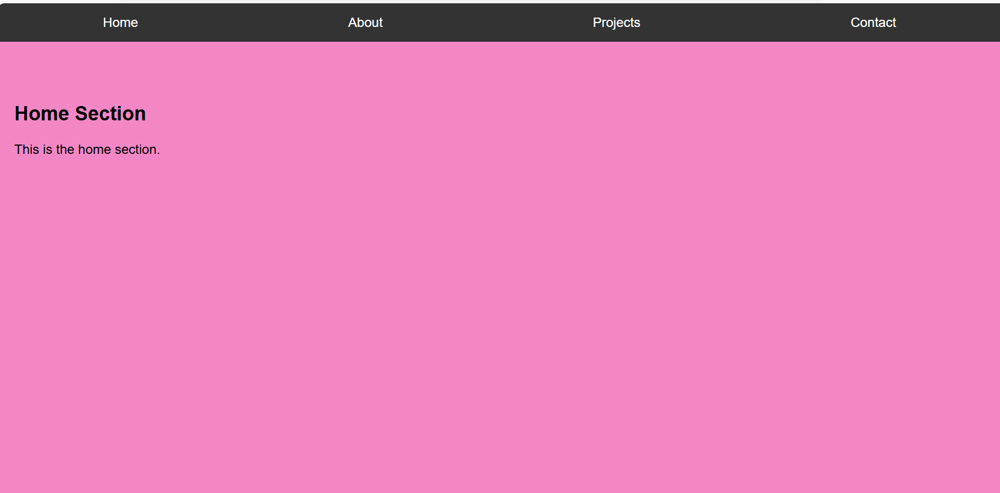
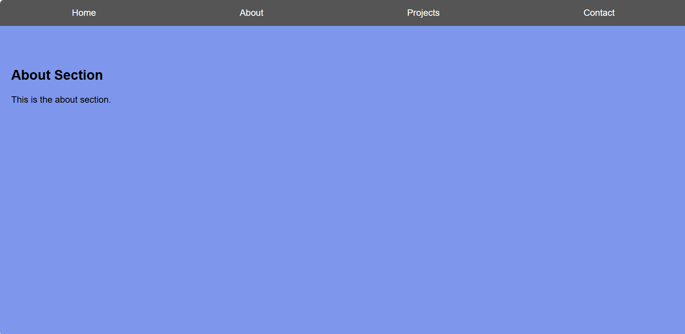

# Interactive Navigation Menu

## Project Overview
This project is a simple yet elegant interactive navigation menu created using HTML, CSS, and JavaScript. The menu changes color or style when scrolled or when hovering over a menu item. The navigation menu is fixed and visible on all pages.

## Features
- **Fixed Navigation Bar**: The navigation bar stays at the top of the page as you scroll.
- **Hover Effects**: Menu items change color or style when hovered over.
- **Scroll Effects**: The background color of the navigation bar changes when you scroll down the page.
- **Responsive Design**: The menu is fully responsive and works on all screen sizes.

## Technologies Used
- **HTML**: For structuring the content.
- **CSS**: For styling the navigation menu, including gradients and hover effects.
- **JavaScript**: For adding interactivity, such as changing colors on scroll and hover.

